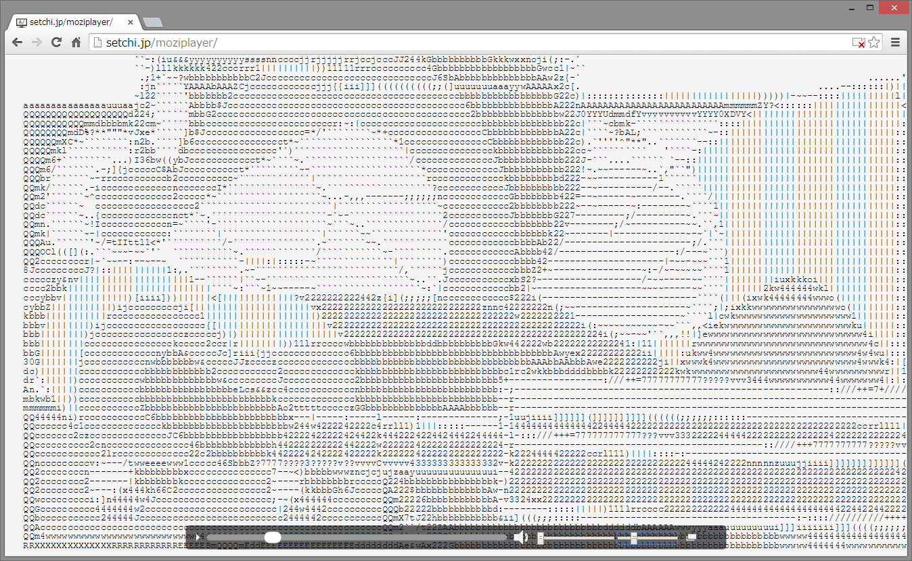

# moziplayer

ドラッグ＆ドロップされた動画ファイルや、インカメラの映像をテキストアートで再生します。[English](https://translate.google.com/translate?sl=ja&tl=en&u=https://github.com/setchi/moziplayer) (by Google Translate)

[https://setchi.jp/moziplayer/](https://setchi.jp/moziplayer/)

## できること
- インカメラの映像をAA再生(アクセス時に許可した場合)
- ドラッグ&ドロップされた動画ファイルをAA再生(HTMLVideoElementで扱える形式のみ)
- AAの解像度を変更(一番右のつまみで変更できます)
- 再生位置調整(動画ファイルのみ)
- 音量調整(動画ファイルのみ)

## 動作環境
最新版のGoogleChromeで動作を確認しています。

## LICENSE
MIT
